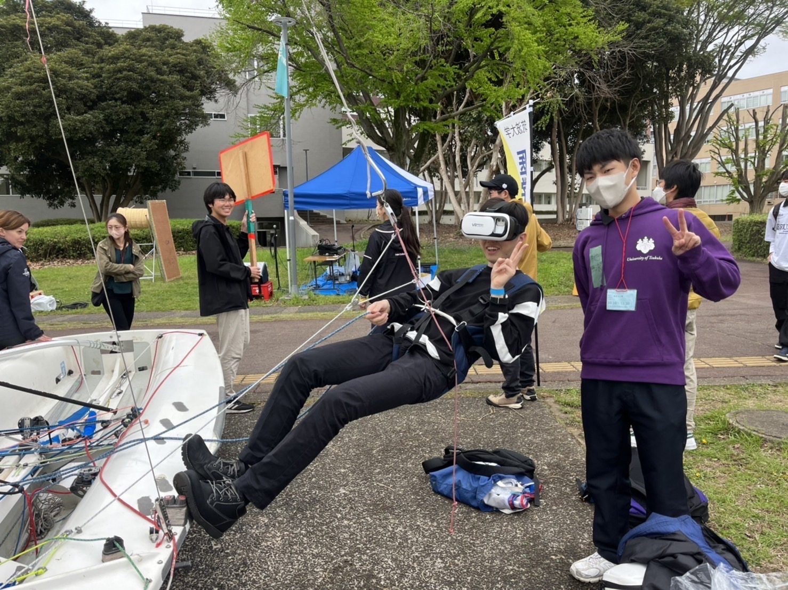

# VRsailing Viewer

このリポジトリは、VRsailing 用に Samsung Gear 360（2017年製）で撮影した前処理を施した360°映像(画像)をスマートフォンやPCで画面をドラッグ、またはスワイプして視点を動かして見られるように GitHub Pages 上に設置した公開サイトです。

リンクを知っている人であれば、PC やスマートフォンのブラウザからそのまま閲覧できます。各 `*.html` は 1 枚の 360° パノラマ画像を埋め込んだ単体ビューアで、追加のアプリやサーバーは不要です。

以前VR新歓用にクルー目線で撮影した動画を専用ビューアー無しで誰でも見れるようにしました。

## 公開ページ

- Port view: https://knakamurajp.github.io/VRsailing_viewer/portview_upwinndsailing_snap_0m19s_1.html
- Starboard view: https://knakamurajp.github.io/VRsailing_viewer/starboradview_upwindsailing_snap_0m49s.html

## 使い方

1. 上の公開 URL をブラウザで開く。
2. 画面をドラッグ、またはスワイプして視点を動かす。
3. マウスホイール、トラックパッド、またはピンチ操作でズームすることもできます。
4. 右上の `Fullscreen` ボタンで全画面表示に切り替えることもできます。
5. 右下の `FOV` スライダーで視野角を調整することもできます。

## ファイル構成

- `index.html`: GitHub Pages のトップページ
- `portview_upwinndsailing_snap_0m19s_1.html`: ポート側視点の 360° スナップショット
- `starboradview_upwindsailing_snap_0m49s.html`: スターボード側視点の 360° スナップショット

## 用途例

### 新歓でのVRセーリング体験

霞ヶ浦でなくとも陸上にいながらリアルなセーリングの臨場感を味わえるツールとして活用できます。(2023年の新歓祭で学内に船体を持ち込んで新歓をした時の写真）

